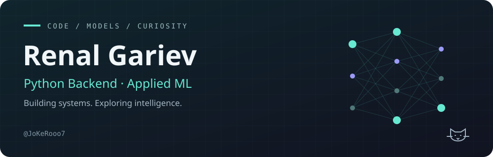
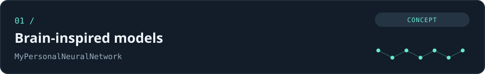
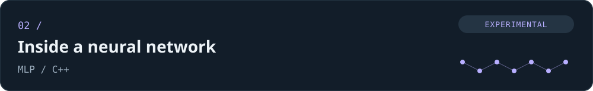

  

  <a href="https://t.me/JoKeRooo7">Telegram</a> ·
  <a href="https://hh.ru/resume/471e1400ff0e1cc11f0039ed1f6d6368496331">Résumé</a> ·
  <a href="README.md">Русский</a>

## Hi, I'm Renal

**Python backend developer working with applied ML and virtual assistants.**

I build backend logic, APIs and assistant workflows. My work includes ML insight ranking, behavioral pattern analysis and expense forecasting. I also have experience testing RAG and NLP approaches to improve support-system responses.

I enjoy understanding systems from the inside: from C++ data structures to neural networks. My interests include mathematics, physics, neuroscience and computational visualization.

### What I work on

- **Backend:** financial-product logic, virtual-assistant workflows and a tax assistant.
- **Applied ML:** ranking, behavioral patterns, time-series forecasting and RAG/NLP experiments.
- **Personal research:** exploring brain-inspired computational models.

### Stack

| Area | Technologies |
| :--- | :--- |
| Backend | Python · FastAPI · Pydantic · SQLAlchemy |
| Data | PostgreSQL · Redis · SQL |
| ML / NLP | scikit-learn · PyTorch · LangChain · FAISS |
| Tools | Docker · Git · Linux · Bash · pytest |
| Algorithms and modeling | C · C++ · NumPy |

### Selected projects

**[MyPersonalNeuralNetwork](https://github.com/JoKeRooo7/MyPersonalNeuralNetwork)** — a long-term research idea: studying principles of brain function and exploring their use in computational models. **Concept stage:** the repository currently contains an idea description, with no implementation or experimental results yet.

**[MLP](https://github.com/JoKeRooo7/MLP)** — experimental C++ perceptron components: neurons, edges, weights and tests. A project for studying neural-network internals; some components are not implemented yet.

**[MazeApp](https://github.com/JoKeRooo7/MazeApp)** — a Python maze-generation and solving application with breadth-first search, a Qt/OpenGL desktop interface and algorithm tests. [Setup instructions →](https://github.com/JoKeRooo7/MazeApp/blob/main/src/README.md)

### Learning

Studying machine learning at **OTUS** and attending the **Financial University under the Government of the Russian Federation**. Building knowledge in ML/DL, mathematics and neuroscience through code and reproducible experiments.

---

**Interested in backend, ML or a collaboration?** [Message me on Telegram →](https://t.me/JoKeRooo7)
